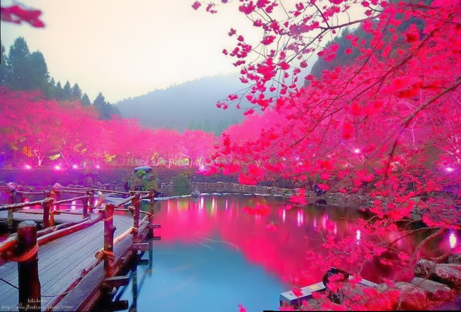

# Stitcher Desktop And Android App

>Image stitching or photo stitching is the process of combining multiple photographic images with overlapping fields of view to produce a segmented panorama or high-resolution image.

*Desktop App in C++ and mobile App in Android*

*library : OpenCv*

# Desktop App

I use the OpenCv Sticher High Level API

```
cd  DesktopApp
make
cd out/
./out --d3 --mode scans ../images/part/*
>> generate result.jpg
```
## Results
| Image1 | Images2 | Result |
|:------:|:-------:|:------:|
|||

# Mobile App

I use [byte deco](http://bytedeco.org/) a JavaCPP Wrapper for OpenCv

## Explanation
The App is compose of three view:

- **The First view:** The "READY TO STITCH !" button request Camera permission and takes you to the next viewcd And .
- **The Second view:** Preview the phone camera and allow you to take 2 photos. These photos aren't save on mobile local stogare but are stored in **RAM memory** in an **array of byte**.
- **The Third view:** Stitch the two array of byte and convert it in one photo or display an message error if the photos haven't similarity.

## Project Structure
```bash
.
├── controllers
│   ├── CameraActivity.java     #Second View Controller
│   ├── MainActivity.java       #First View Controller
│   └── SticherResult.java      #Third View Controller
├── globals
│   └── Globals.java            #Static variable to store array of byte images
└── models
    ├── CameraPreview.java      #Create and Destruct Camera Preview 
    └── Stitching.java          #The Sticher Model which use byte deco Sticher High Level API Wrapper
````

## Results

